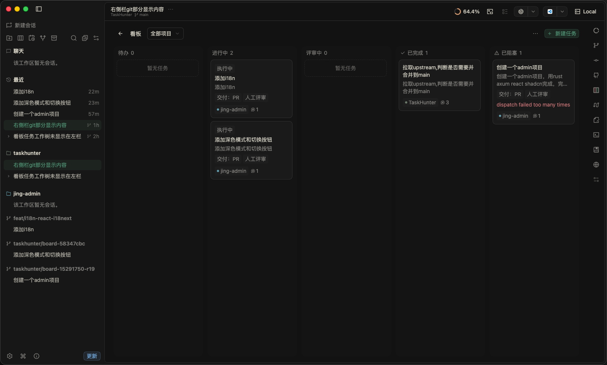
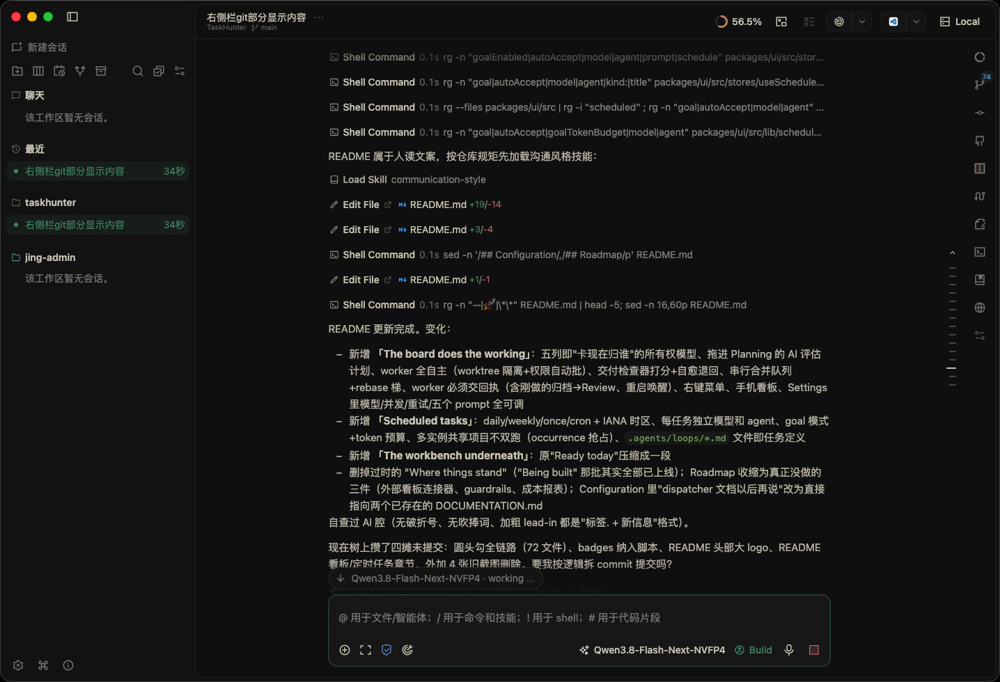
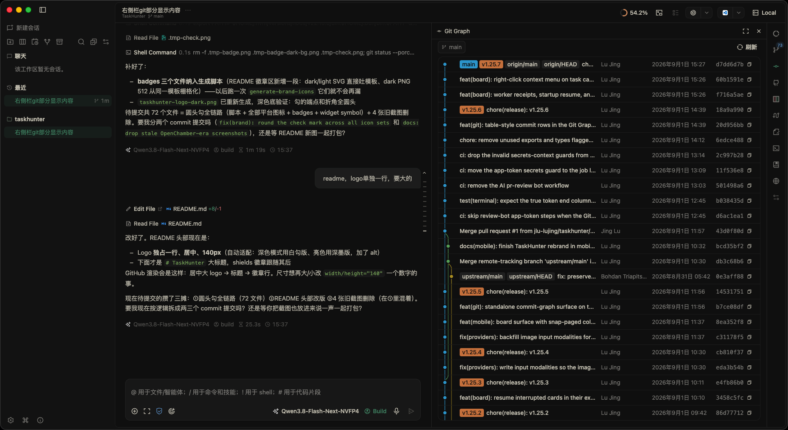
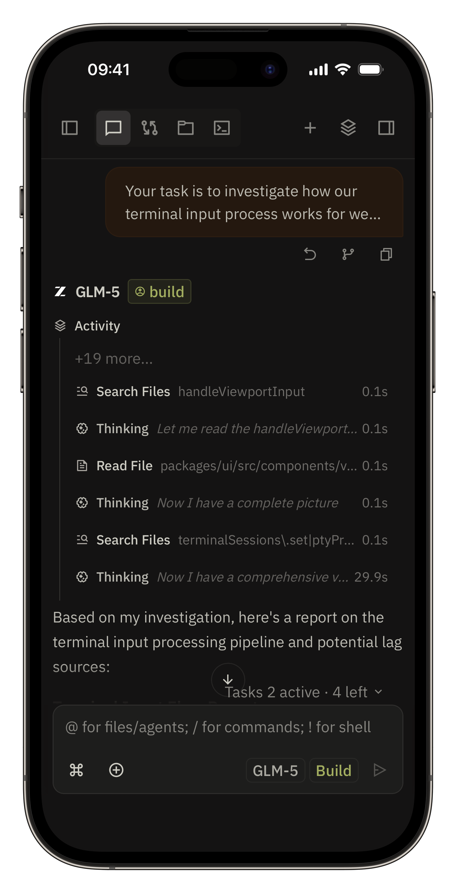
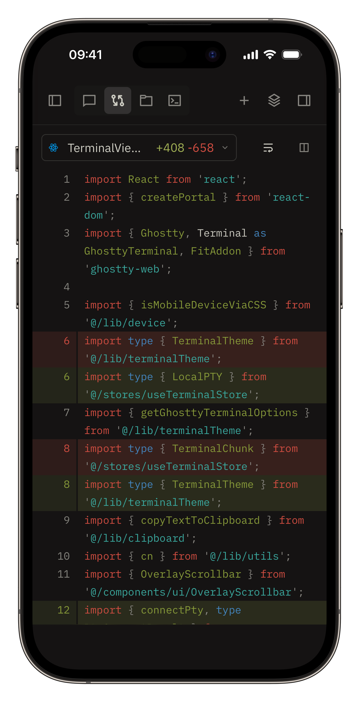

<div align="center">
  <picture>
    <source media="(prefers-color-scheme: dark)" srcset="docs/references/badges/taskhunter-logo-dark.svg">
    
  </picture>
</div>

# TaskHunter

[](https://github.com/jlu-lujing/TaskHunter/stargazers)
[](https://github.com/jlu-lujing/TaskHunter/releases/latest)

> [!NOTE]
> Built on [OpenChamber](https://github.com/openchamber/openchamber) (personal fork, maintained independently) and [OpenCode](https://opencode.ai). This fork does not publish to npm or the VS Code Marketplace. Some optional features still call upstream OpenChamber services unless self-hosted (`TASKHUNTER_RELAY_URL`, `TASKHUNTER_LINEAR_BROKER_URL`, `TASKHUNTER_UPDATE_API_URL`).

## What this is

TaskHunter is an agent that runs your task board for you. Tasks sit on a board, and when one moves to "ready", TaskHunter picks it up, opens a coding agent session for it, does the work in an isolated workspace, and brings it back to you as a reviewable result.

The loop it is built around:

```
board task (ready) -> claim -> agent session (OpenCode) -> code + tests -> PR / review request -> board updated
```

You stay in the loop where you want to be. Approve plans, review diffs, answer the agent's questions from desktop, browser, or phone. Everything else it handles on its own.



## The board does the working

The board has five columns, and each one names who owns the card right now: Backlog (you), In progress (the agent pipeline), Review (you), Done, and Blocked (needs attention). Cards in "In progress" carry a stage badge so you always know whether the planner, the worker, the delivery checker, or the merge bot has it.

- **Plan first.** Drag a card into Planning and an evaluator model writes a launch plan for it: completion criteria, whether the deliverable is a pull request or a report, and whether the finish needs your review or can auto-merge on green CI. You approve it, or auto mode does.
- **Workers run unattended.** A free slot picks the oldest approved card, spawns a session in its own git worktree and branch, and turns on permission auto-accept so nothing stalls on a "yes?" prompt at 3am. Parallel cards never step on each other's files.
- **Nothing passes on a vibe.** Before a card advances, a delivery checker grades the deliverable: reports are judged against the criteria, PR cards wait for CI and then get an AI pre-review of the diff. A failing grade bounces back to the same worker with concrete fix notes, up to a retry budget you set.
- **Merges are a serial queue.** Green PRs merge one at a time, oldest first, with a rebase ladder for conflicts. A card that can't resolve burns its retries and lands in Blocked with the reason printed on it, not lost in a log.
- **Cards always answer to you.** Workers hand back an outcome (done, nothing-to-do, blocked) before they stop; a worker session that gets archived mid-run sends its card to Review with the reason instead of pretending to work. Cards interrupted by an app restart wake up in their existing session and worktree. Review gives you merge / accept / return-with-a-note, and right-clicking any card opens the full menu. The board works on the phone too, one column per swipe.
- **Tunable from Settings.** Pick the pipeline model and concurrency, the approval mode, the retry budgets, and retune all five pipeline prompts under Magic prompts.

## Scheduled tasks

Recurring work that shows up as sessions, not cron noise.

- Daily, weekly, once, or raw cron, in an explicit IANA timezone. Each task pins its own model and agent.
- A firing task opens a fresh session in its project and runs your prompt like any other session. Turn on goal mode and it keeps at the job until the finish condition is met, with a token budget you cap.
- Enable, disable, run now, and see the last run's status. Runs land in your session list, so watching one is the same as watching any session.
- Several TaskHunter servers sharing one project won't double-fire. Occurrences are claimed once in the shared project config, whoever wins the claim does the run.
- Prefer markdown? Drop a task into `.agents/loops/*.md` (per project, or `~/.agents/loops/` for all of them) and TaskHunter adopts it as a scheduled task on the next sync.

## The workbench underneath

The board rides on the full agent workbench, inherited from the OpenChamber execution layer: OpenCode-powered sessions with terminal, diffs, and file editing, session goals, worktree isolation, GitHub integration to start sessions from issues and PRs, and clients for desktop, web/PWA, VS Code, and mobile.



Commit history has its own surface too, with lanes, ref badges, and per-commit actions:



Same app in your pocket, sessions, diffs and the board included:

<table>
<tr>
<td></td>
<td></td>
</tr>
</table>

## Quick start

Requires Node.js 22+ and the [OpenCode CLI](https://opencode.ai). Run from a checkout:

```bash
bun install
node packages/web/bin/cli.js serve --ui-password be-creative-here
```

Common operations:

```bash
taskhunter status
taskhunter logs
taskhunter stop
taskhunter update
```

TaskHunter binds to localhost by default. Use `--lan` only on a trusted network and protect browser access with `--ui-password`.

To build the desktop app or the VS Code extension from source, see [CONTRIBUTING.md](./CONTRIBUTING.md).

## Configuration

State lives in `~/.config/taskhunter` (board, schedules, settings). Environment overrides use the `TASKHUNTER_*` prefix. The documentation set in [`packages/docs`](packages/docs/README.md) covers the workbench layer; board and scheduled-task internals are documented in `packages/web/server/lib/board/DOCUMENTATION.md` and `packages/web/server/lib/scheduled-tasks/DOCUMENTATION.md`.

## Roadmap, roughly

1. Board connectors: watch Linear, GitHub Projects, or a local file for tasks entering "ready", instead of hand-entering cards
2. Guardrails: token budgets per task, allowlists for what an agent may touch, quiet hours
3. Cost reporting across boards and schedules

Priorities will move as real usage finds them.

## Why OpenCode?

TaskHunter drives coding agents through [OpenCode](https://opencode.ai). It is the best open-source option for this job right away: real terminal access, model-agnostic, and built to be driven programmatically. TaskHunter is an independent project and is not affiliated with the OpenCode team.

## Acknowledgments

- [OpenChamber](https://github.com/openchamber/openchamber) and its contributors, whose workspace this fork builds on
- [OpenCode](https://opencode.ai) for the agent runtime
- [Pierre](https://pierrejs-docs.vercel.app/) for its diff viewer and syntax highlighting
- [Ghostty-web](https://github.com/coder/ghostty-web) for its Ghostty web renderer

## License

MIT. See [LICENSE](./LICENSE).

TaskHunter is a fork of [OpenChamber](https://github.com/openchamber/openchamber). The original OpenChamber code is Copyright (c) 2025 Bohdan Triapitsyn and remains under the MIT License; that license requires keeping their copyright notice, which the fork preserves. The TaskHunter modifications, additions, and branding are Copyright (c) 2026 Lu Jing, also under MIT.

TaskHunter is an independent project, not affiliated with or endorsed by OpenChamber, Bohdan Triapitsyn, or the OpenCode team. The TaskHunter name and logo are the fork's own.
